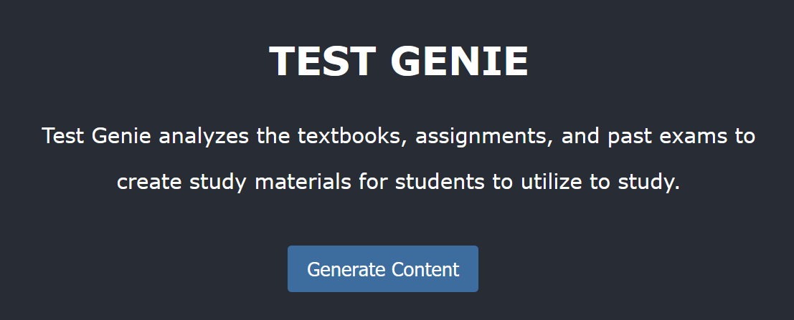

# Test Genie

**Authors:** Sean (seanyl2), Sanhorn (sanhorn2), Kelly (kellyy3), Jasmine (jchan59)  
**Description:** A web application that helps students prepare for exams by generating practice tests and lecture summaries from uploaded materials.

---

## Table of Contents
- [Project Overview](#project-overview)
- [Features](#features)
- [Technologies](#technologies)
- [Project Structure](#project-structure)
- [Getting Started](#getting-started)
- [Usage](#usage)
- [Potential Risks and Challenges](#potential-risks-and-challenges)
- [Team Contributions](#team-contributions)

---

## Project Overview
Test Genie is a comprehensive study aid tool designed for students who struggle to find effective resources to prepare for exams. By analyzing uploaded lecture notes, past exams, and assignments, Test Genie utilizes advanced AI capabilities to:
- Generate detailed summaries of lecture content.
- Create customized practice exam questions based on past exams.

Test Genie aims to streamline study preparation by providing resources tailored to individual students’ needs.

---

## Features

### User Functionality:
1. **File Uploads:**
   - Users can upload lecture notes, past exams, and assignments in PDF format.
2. **Generated Content:**
   - Practice Exams: Based on uploaded past exams, the AI generates new practice questions.
   - Lecture Summaries: Summaries of uploaded lecture notes with detailed insights for students to review.

### Backend Functionality:
- API endpoints for file uploads and AI content generation.
- Integration with a language model (Llama LLM).

---

## Technologies

### Frontend:
- **Framework:** React.js
- **Languages:** JavaScript
- **Testing Tools:** React Testing Library

### Backend:
- **Framework:** Python
- **APIs:** FASTAPI design for seamless frontend-backend integration

### AI Model:
- **Language Model:** Llama 3.2 (via Ollama)
- **Fine-tuning:** Customized for test question generation and lecture notes summarization tasks

### Style Guide:
- **Backend:** FastAPI for Python
- **Frontend:** ESLint for JavaScript

---

## Project Structure

```plaintext
project-root/
|-- frontend/                  # React frontend
|   |-- public/
|   |-- src/
|       |-- components/        # React components (e.g., UploadContent, NotesSummary)
|       |-- context/           # Context API (e.g., TextContext)
|-- backend/                   # FastAPI Backend
|   |-- app/
|       |-- api/               # API endpoints (e.g., upload.py)
|       |-- services/          # AI service integrations (e.g., ollama_service.py)
|-- README.md
```

---

## Getting Started

### Prerequisites
1. React (for frontend development)
2. Python (for backend development)
3. Ollama (for llm development)

### Installation

#### Clone the Repository:
```bash
$ git clone https://github.com/your-github-repo/test-genie.git
$ cd test-genie
```

#### Frontend Setup:
```bash
$ cd frontend
$ npm install
$ npm run start
```

#### Backend Setup:
```bash
$ cd backend/app
$ pip install -r requirements.txt
$ uvicorn main:app --reload
```

---

## Usage

### Uploading Files
1. Navigate to the **Upload Content** page.
2. Select and upload a PDF file (lecture notes, past exams, or assignments).

### Generating Summaries
1. After uploading lecture notes, click the **Generate Notes Summary** button.
2. Detailed summary of the notes generated by the AI model will be shown in the page.

### Generating Practice Tests
1. After uploading past exams, click the **Generate Practice Exam** button.
2. 10 Practice Questions generated by the AI model will be shown in the page.

---

## Potential Risks and Challenges

### Frontend-Backend Integration
- Debugging issues in API communication might delay progress. Regular integration tests are planned.

### AI Model Fine-Tuning
- Poorly fine-tuned models may generate irrelevant or incorrect content. We plan to rigorously test the model and refine it using specific datasets.

### Ethical Concerns
- AI-generated content could inadvertently contain biases. Please be careful to the results generated.

---

## Team Contributions

### Frontend:
- Kelly (kellyy3) and Jasmine (jchan59)
  - Responsible for creating the user interface, file uploads, and API integration.

### Backend:
- Sean (seanyl2) and Sanhorn (sanhorn2)
  - Developed the backend, API endpoints, and integrated the Llama LLM model.

---

## Feedback and Contributions
We welcome feedback and contributions from the community. Please create a pull request or open an issue on our GitHub repository.
For future collaboration, please contact:  ("seanyl2" or "sanhorn2" or "kellyy3" or "jchan59") + @illinois.edu